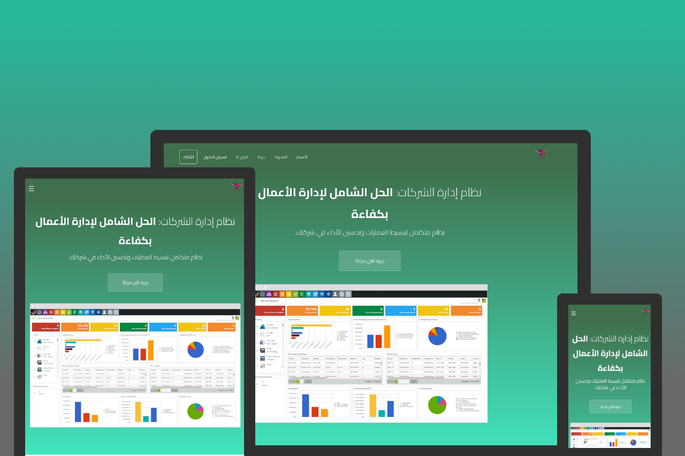

# تصميم موقع تسويق

التصميم الأولي من قبل [CloudCannon](http://cloudcannon.com/)، معرّب ومعدّل من قبل فريق شركة رواج الإتقان لتقنية المعلومات. مرخص برخصة Creative Commons Attribution 3.0 Unported

## Features

* Contact form
* Pre-built pages
* Pre-styled components
* Blog with pagination
* Post category pages
* Disqus comments for posts
* Staff and author system
* Configurable footer
* Optimised for editing in [CloudCannon](http://cloudcannon.com/)
* RSS/Atom feed
* SEO tags
* Google Analytics

## Setup

1. Add your site and author details in `_config.yml`.
2. Add your Google Analytics and Disqus keys to `_config.yml`.
3. Get a workflow going to see your site's output (with [CloudCannon](https://app.cloudcannon.com/) or Jekyll locally).

